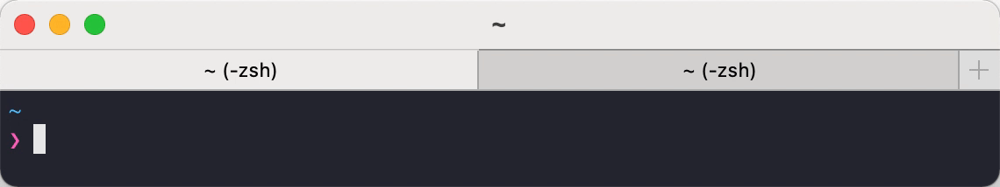
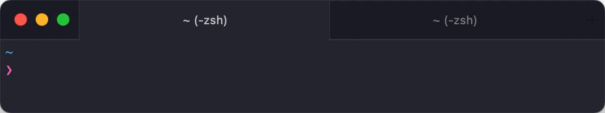

# 🖌️ Styling terminal


## Getting rid of ugly title bar

Go to `Preferences` -> `Appearance` -> `General` ->  `Theme`: **Minimal**

<figure><figcaption></figcaption></figure>

<figure><figcaption><p>Before</p></figcaption></figure>

<figure><figcaption><p>After</p></figcaption></figure>

You can make the tab outline less prominent with:

iTerm `Preferences` -> `Advanced`

Set the value of tab outline in minimal theme to `0.1`


Filter advanced settings with keyword:&#x20;

`in the minimal theme how prominent should the tab outline be`?


<figure><figcaption></figcaption></figure>


## Install iTerm Snazzy Theme

Run this command to download iTerm Snazzy color scheme:


```bash
(curl -Ls https://raw.githubusercontent.com/sindresorhus/iterm2-snazzy/main/Snazzy.itermcolors > /tmp/Snazzy.itermcolors && open /tmp/Snazzy.itermcolors)
```


After downloading theme, set it in iTerm Preferences:

`Profiles` -> `Colors` -> `Color Presets`: **Snazzy**

<figure><figcaption></figcaption></figure>


Pro tip: If you don’t like this theme, you can probably find your favorite theme here: [https://iterm2colorschemes.com](https://iterm2colorschemes.com/)


###

### Hide Dock icon

To remove iTerm dock icon and hide it from `⌘` + `Tab` turn on

`Preferences` -> `Appereance` -> `Exclude from Dock and ⌘-Tab Application Switcher`

<figure><figcaption></figcaption></figure>
