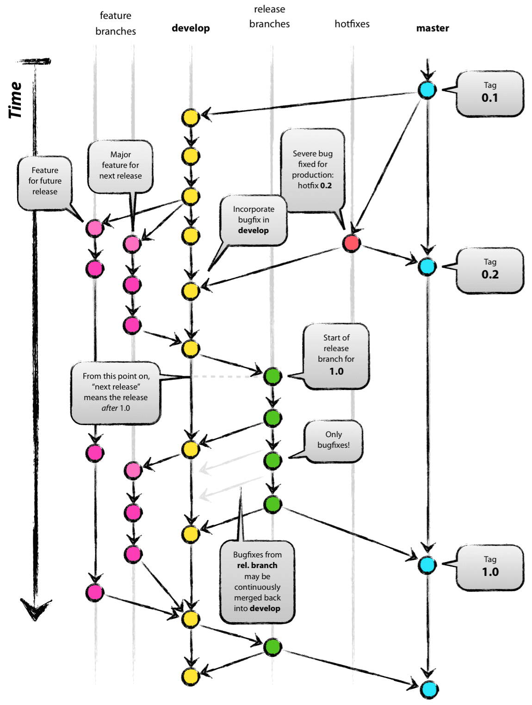

# Git Flow AVH

Git Flow AVH is as enhanced collection of Git extensions to provide high-level repository operations for Vincent Driessen's [branching model](http://nvie.com/git-model).&#x20;

<figure><figcaption></figcaption></figure>

Installing Git Flow AVH with brew:

```bash
brew install git-flow-avh
```

For activation add it to `~/.zshrc` plugins list:

```bash
# ~/.zshrc

...

# Which plugins would you like to load?
# Standard plugins can be found in $ZSH/plugins/
# Custom plugins may be added to $ZSH_CUSTOM/plugins/
# Example format: plugins=(rails git textmate ruby lighthouse)
# Add wisely, as too many plugins slow down shell startup.
plugins=(git git-flow-avh)

...
```

## Git Flow AVH completion

After installation of git flow AVH brew also downloads bash completion script for AVH.

For activation bash completion, simply load all `site-functions` of brew if not done it before:

```bash
# Very end of ~/.zshrc file

....

# -- autoload plugins
if type brew &>/dev/null; then
    FPATH=$(brew --prefix)/share/zsh/site-functions:$FPATH
    autoload -Uz compinit
    compinit
fi

```

After restarting terminal, or simply typing `source ~/.zshrc` will give you bash completion for git flow AVH
